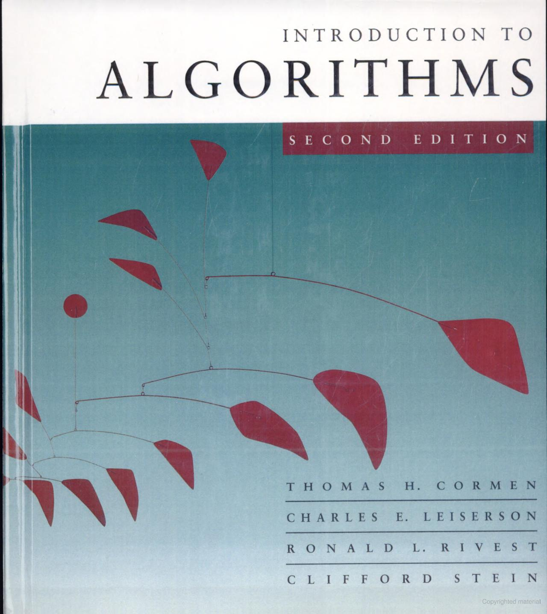

# Introduction to algorithms

These are my notes that I have taken from the book Introduction to algorithms (Second Edition) for my 5th semester of my bachelor's in comp sci.

The authors of the book are:

- Thomas H. Cormen
- Charles E. Leiserson
- Ronlad L. Rivest
- Clifford Stein

# Book cover

